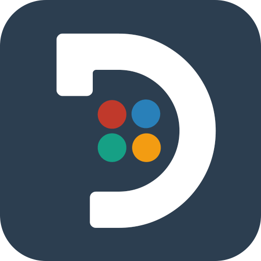

## Dafunda.com
- *Android Developer* | August 2020 - October 2020
- 
- Tags: Full Time
- Badges:
  - Kotlin [blue]
  - Android Studio [blue]
- List Items:
  - Create an android application for Dafunda readers.

## PT Nirvana Indonesia Yoga
- *Android & iOS Developer* | January 2021 - August 2021
- 
- Tags: Full Time
- Badges:
  - React Native [green]
  - JavaScript [red]
- List Items:
  - Create an Android & iOS application for Nirvana Store.
  - Publish app on Play Store and App Store

## PT Indomas Tirta Kencana Abadi (Intika)
- *Fullstack Web & Android Developer* | August 2021 - Present
- 
- Tags: Full Time
- Badges:
  - Laravel [blue]
  - PHP [blue]
  - React Native [green]
  - JavaScript [red]
- List Items:
  - Create an Android application for company operations.
  - Create an Website application for company operations.

## PT Rackh Lintas Asia
- *Intern Android Developer* | March 2019 - May 2019
- 
- Tags: Internship
- Badges:
  - Laravel [blue]
  - PHP [blue]
  - Android Studio [blue]
  - Java [blue]
  - Kotlin [blue]
- List Items:
  - Learn and make android application for internship assignments.

## PT. Mitra Pasifik Solusindo (MPSSOFT)
- *Intern Android Developer* | March 2019 - May 2019
- 
- Tags: Internship
- Badges:
  - Laravel [blue]
  - PHP [blue]
  - Android Studio [blue]
  - Java [blue]
  - Kotlin [blue]
- List Items:
  - Learn and make owibu application for internship assignments.